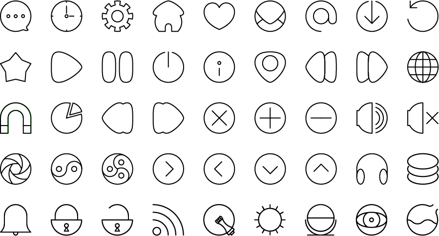

# **around in circles** (35 icons)

This is a simple icon font drawn in illustrator and put together with [icomoon](http://icomoon.io/app/).

Shapes are very geometric, making use of the same circle for each icon to give it coherence throughout the whole design.

Feel free to tweak, fork, improve, increment, add, request, pull, push, use and abuse.

**I am taking requests**. Tell me of any idea you might have and i’ll try to add it.

♥

F.